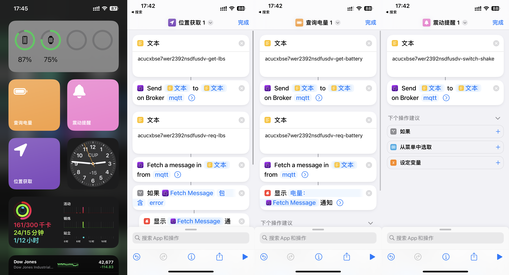
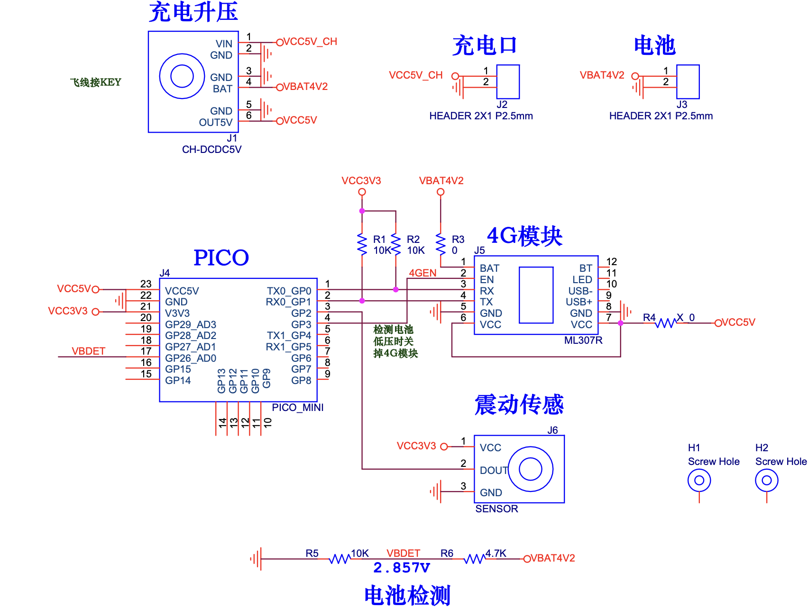

基于ML307R与RP2040(树莓派Pico)实现的自行车挪动预警与定位硬件


## 功能配置

### 设置通知与MQTT

### 为硬件安装固件

1. 在vscode中安装 Raspberry Pi Pico 扩展与 IntelliCode 扩展

2. 给 Pico 烧录好 MicroPython 的 uf2 固件 (自行谷歌)

3. 打开main.py, 对其进行配置

```python
NOTIFY_URL = '' # 填入推送通知的链接(注意最后带 / ), 如 Bark 的 http://api.day.app/TX72mvgBTSoGqy5F/
JUST_NOTIFY = False # 如果为 True 则仅使用通知不使用 MQTT, 会缺少 电量查询/定位/关闭通知 等功能, 但同时节约电量
# 如果只需要通知功能, 或者为了省电, 只需要填写 NOTIFY_URL
# 并且 JUST_NOTIFY = True
# 此时下面的项目不需要填写

MQTT_URL = 'broker.emqx.io' # 公共的 MQTT 服务器, [唯一ID] 一定要自己重设, 或者为了安全可以换用自己的服务器
MQTT_PORT = 1883 # 端口
MQTT_USERNAME = '' # 用户名 (公共服务器不需要填)
MQTT_PASSWORD = '' # 密码 (功能服务器不需要填)

UNIID = 'acucxbse7wer2392nsdfusdv' # 唯一ID, 随便敲一些字符就行, 主要是公共服务器会订阅有冲突问题
LBS_API = '' # 高德开静态地图定位API, 用自己的API
```

4. 点击 Run 验证功能是否正常
5. 点击 All commands -> Upload Project To Pico
6. 关闭 VsCode, 设备重新上一次电, 验证功能是否正常

### 如何验证功能是否正常?

1. 设备开机会发送通知(爱车看门狗 震动检测开启), 未发送则表示有问题
2. 摇动设备会发送通知
3. 验证 MQTT 功能是否正常 (待补充)

## [扩展] IOS 查看/设置 设备

### 快捷指令的设置

点击分享的链接获得快捷指令模版, 在 [填写你自己的UNIID] 中填写好, 验证是否有效.

改好UNIID后如图, 可以添加桌面或者负一屏 (UNIID示例取自 main.py 中的默认值):



### 快捷指令🔗分享

震动提醒: https://www.icloud.com/shortcuts/cb29e71f1fa84ab0826500942d10e883

查询电量: https://www.icloud.com/shortcuts/9b71ff0aa79f40c9a60abf1565f751ab

位置获取: https://www.icloud.com/shortcuts/a12aa330ff734be7917f60d623da9966


## 硬件相关说明

### 物料表

### PCB原理图:



